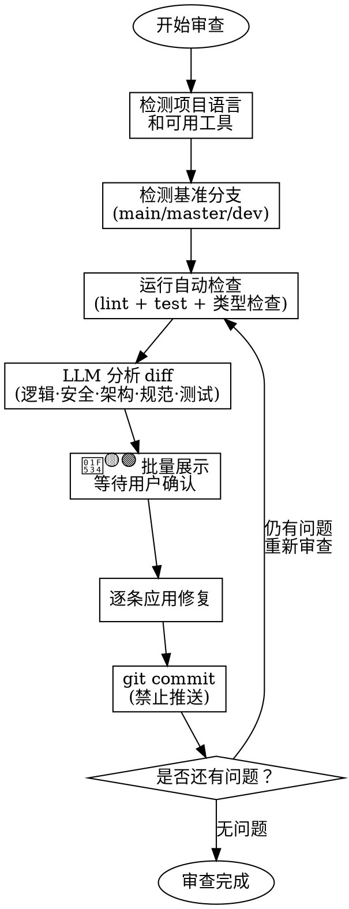

# Branch Code Review & Fix Loop

对当前分支的代码改动进行审查、修复、验证的循环流程。自动检测项目语言和可用工具，结合工具检查与 LLM 审查，逐条确认修复后提交。**最多循环 5 轮**。

## 核心原则

- **先验证再修复**：审查发现的每个问题都是**待验证的假说**，而非既成事实。修复前必须重新读取上下文确认问题真实存在，避免误报修复。
- **不定则停**：对任何问题的修复方案不明确时，暂停并询问用户，不要猜测。
- **审查宜频**：在分支开发过程中尽早审查、频繁审查，而非等所有改动完成后一次性审查。
- **允许反驳**：LLM 审查可能产生误报。用户可以说「忽略」来驳回误判问题。技术上正确比表面全面更重要。



## 审查类型说明

| 类型 | 检查内容 | 工具/方法 |
|------|---------|----------|
| 代码风格 | 格式、命名、行长度、复杂度、空行/注释 | 项目 linter（ruff/eslint/clippy/...） |
| 类型安全 | 类型错误、类型注解缺失、不匹配 | 类型检查器（mypy/tsc/...） |
| 代码可维护性 | 函数长度/复杂度、魔法数字、重复代码、可读性、模块耦合度 | LLM 分析 diff |
| 测试覆盖 | 新增功能是否有对应测试、测试是否通过 | 测试框架（pytest/jest/cargo test/...） |
| 逻辑缺陷 | 空值/边界/异常处理、死代码、竞态条件 | LLM 分析 diff |
| 安全漏洞 | 硬编码凭证、注入风险、危险函数、敏感信息日志 | LLM 分析 diff |
| 架构设计 | 模块依赖方向、接口一致性、抽象层级、数据流、错误传播 | LLM 分析 diff |
| 无意义格式变更 | 仅空白/缩进/换行/引号/分号变更、无逻辑改动的纯格式 diff | LLM 分析 diff |

## 执行步骤

### 阶段 1：环境准备

1. **检测项目语言和可用工具**：扫描项目根目录的配置文件和 lock 文件，确定语言栈，再检查对应工具是否可用。

   语言检测优先级（按文件名）：
   | 语言 | 标识文件 | 工具探测 |
   |------|---------|---------|
   | Python | `pyproject.toml`, `setup.py`, `requirements.txt` | `ruff`, `mypy`, `pytest`, `bandit` |
   | TypeScript/JS | `package.json`, `tsconfig.json` | `eslint`, `prettier`, `tsc`, `jest`, `vitest` |
   | Rust | `Cargo.toml` | `cargo clippy`, `cargo fmt`, `cargo test` |
   | Go | `go.mod`, `go.sum` | `go vet`, `gofmt`, `golangci-lint`, `go test` |

   对每种检测到的工具，使用 `--version` 确认可用性。若项目有包管理器（uv/npm/cargo/go），优先通过包管理器调用：
   ```bash
   # 示例：Python 项目用 uv，JS 项目用 npx，否则直接调用
   <pkg-mgr> run <tool> --version 2>/dev/null || <tool> --version 2>/dev/null
   ```

   若所有工具都不可用，跳过自动检查，仅做 LLM 分析。

2. **确定基准分支**：按优先级尝试 `main` → `master` → `dev` → `develop`
   ```bash
   for b in main master dev develop; do
     git rev-parse --verify origin/$b 2>/dev/null && { BASE="$b"; break; }
   done
   ```

3. **获取当前分支名**：`git branch --show-current`
4. **获取变更文件列表**：`git diff --name-only origin/$BASE...HEAD`

### 阶段 2：自动检查

按顺序运行，失败不阻塞后续步骤。记录所有输出。

1. **Linter / 格式检查**
   ```bash
   # 对变更文件运行 linter（若有 linter 工具）
   <linter> <check-cmd> <changed_files>
   ```
   提取每条告警的：文件路径、行号、规则码、描述。

2. **类型检查**（若检测到类型检查器）
   ```bash
   <type-checker> <changed_files_or_all>
   ```
   记录类型错误的文件和行号。

3. **测试运行**
   ```bash
   <test-runner>
   ```
   记录失败测试的名称、错误类型、堆栈。

### 阶段 3：LLM 审查

读取 `git diff origin/$BASE...HEAD` 的完整内容。从以下七个维度逐一审查，每个问题定位到具体文件和行号，并给出「建议修复方案」：

#### 3.1 逻辑缺陷
- 空值/None/nil/undefined 访问风险
- 数组越界、字典 KeyError、索引不存在
- 异常处理缺失或不恰当（裸 except、吞异常）
- 死代码、不可达分支
- 并发/异步场景下的竞态条件
- 算术溢出、除零

#### 3.2 安全漏洞
- 硬编码的密钥、token、密码、API key
- SQL/命令/路径注入风险（拼接 SQL、`os.system`、`subprocess(shell=True)`）
- 不安全的反序列化（`pickle.load`、`yaml.load`、`eval`）
- 敏感信息写入日志（password、token、secret）
- 缺少输入校验（用户输入直接用于文件/网络操作）
- 不安全的权限设置（`chmod 777`）

#### 3.3 代码可维护性
- **函数/方法长度**：单函数是否超过合理长度（参考：50 行以内为佳，超过 100 行应拆分）
- **圈复杂度**：逻辑分支是否过多（嵌套 if/for/while 超过 3 层需关注）
- **魔法数字**：是否存在未命名的硬编码数值（如 `if status == 3` 中的 `3`）
- **重复代码**：同一段逻辑是否在多处重复出现（DRY 原则）
- **命名可读性**：变量/函数/类名是否清晰表达意图，是否存在单字母变量名（除循环索引外）
- **模块耦合度**：新增模块是否过度依赖其他模块的内部实现细节，而非通过公共接口交互
- **业务逻辑错位**：具体业务逻辑是否被放在了通用/公共文件中（如 `utils.py`、`common.py`、`helpers.py` 中包含了仅特定功能使用的代码），而非放在对应的业务模块内。**判定**：将 public 文件中的业务代码移动到其对应的业务模块中
- **可测试性**：关键逻辑是否可被独立测试（有无隐藏的全局状态、硬编码依赖）

#### 3.4 架构设计
- **模块依赖方向**：是否存在反向依赖（底层模块依赖上层）、循环依赖
- **接口一致性**：新增/修改的公共接口是否与已有的模式一致（参数顺序、返回值类型、异常约定）
- **抽象层级**：同一函数内是否混杂了不同抽象层次的操作（如业务逻辑中直接操作数据库连接）
- **数据流与边界**：数据在各层（API→Service→Repository）之间传递是否清晰，有无跨层直接访问
- **错误传播**：错误是否在正确的边界被捕获和转换，有无错误被吞没或泄露内部实现细节
- **职责分离**：是否存在"上帝类/上帝函数"承担过多职责
- **变更影响面**：修改是否破坏了现有接口的契约（参数语义变化、返回值格式变化）

#### 3.5 代码风格/规范
- 项目配置文件中的风格规则是否被遵守（行长度、缩进、命名约定）
- 是否与项目现有代码模式一致（函数命名、文件组织结构）
- 新增代码是否有必要的注释（复杂逻辑说明，而非冗余注释）
- 是否有明显的代码重复

#### 3.6 测试覆盖
- 新增/修改的公开函数是否有对应的测试
- 关键分支和边界条件是否有覆盖
- 测试是否真正验证了预期行为（而非仅为覆盖率而写）

#### 3.7 依赖与配置
- 是否引入了不必要的新依赖
- 配置文件变更是否可能影响其他环境
- 是否有遗留的调试代码（print、console.log、debugger）

#### 3.8 无意义格式变更
- diff 中是否存在仅修改空白字符（空格/制表符替换、缩进调整）而无逻辑变动的行
- 是否存在仅批量替换引号风格（单引号↔双引号）、分号风格等的纯格式改动
- 是否存在仅改换行风格（行尾符号、行连接/断开）而无语义变更的改动
- 是否存在大量与业务逻辑无关的 import 排序/重排
- **判定标准**：若 diff 中某文件的改动超过 50% 行都属于上述纯格式变更，标记为「存在无意义格式变更」
- **建议**：将纯格式变更从当前分支移除（或单独提一个 format-only commit），确保当前分支 diff 聚焦于逻辑变更

### 阶段 4：批量展示并确认

将所有问题（自动检查结果 + LLM 审查发现）合并去重，按严重程度排序：

| 级别 | 范围 |
|------|------|
| 🔴 高 | 安全漏洞、会导致 crash/数据损坏的逻辑缺陷、破坏性架构问题 |
| 🟡 中 | 接口不一致、测试缺失、错误传播不当、依赖滥用 |
| 🟢 低 | 命名不规范、缺少注释、代码重复、小范围风格偏差 |

展示格式：
```
## 当前分支审查结果 (feat/xxx)

### 🔴 高优先级 (3 条)
1. **空指针风险** — `src/service.py:42`
   - 问题：`result.data` 可能为 None，直接访问会抛异常
   - 建议：添加 `if result.data is not None:` 守卫

2. **硬编码密钥** — `config/base.py:15`
   - 问题：API_SECRET 直接写死在代码中
   - 建议：改为从环境变量读取 `os.getenv("API_SECRET")`

### 🟡 中优先级 (2 条)
3. **循环依赖** — `app/models.py` ↔ `app/services.py`
   - 问题：models 模块 import 了 services，而 services 也 import models
   - 建议：将共享类型抽到 `app/types.py`

### 🟢 低优先级 (1 条)
4. **命名不一致** — `alg/processor.py:30`
   - 问题：函数使用 camelCase，项目其他部分是 snake_case
   - 建议：重命名为 `process_image`
```

展示后等待用户回复。用户指令模式：
- `全部修复` → 按序号依次修复所有问题
- `修复 1,3,5` → 只修复指定序号的问题
- `跳过 2，修复其他` → 跳过指定，修复其余
- `修复 1，但用 xxx 方案` → 按用户指示修改方案后修复
- `只修复高优先级` → 只处理 🔴 高优先级
- `忽略 3` / `3 不是问题` → 驳回误报问题，不再处理
- `不修复，停止` → 终止流程
- `继续审查` → 不修复任何问题，直接进入下一轮审查（可用在仅想查看问题清单时）

### 阶段 5：逐条执行修复

对每条用户确认的问题，执行以下三步：

**步骤 5.1：验证问题真实性**
1. 读取问题所在文件的相关上下文（至少 50 行范围）
2. 确认问题确实存在于当前代码中（而非 diff 上下文误读或工具误报）
3. 若验证后发现是误报 → 告知用户，标记「误报，跳过」，继续下一条
4. 若修复方案不明确（如存在多种可行方案且无法判断用户偏好）→ 暂停并询问用户

**步骤 5.2：应用修复**
1. 应用修复（使用 Edit 工具）
2. 修复后运行项目的 linter 确认无新增格式问题
3. 若修复失败则跳过，标记 `[SKIPPED]`，继续下一条

**步骤 5.3：自我复核**
1. 重新读取修复后的代码片段，确认改动符合预期
2. 确认没有引入新的明显问题

### 阶段 6：提交修复

每次修复成功后立即提交：
```bash
git add <修复涉及的文件>
git commit -m "fix: <简洁中文描述>"
```

- 提交信息格式：`<type>: <中文描述>`（参照项目 AGENTS.md 规范）
- **绝对禁止**：`git push`、`git push --force`、`git push --force-with-lease`

### 阶段 7：循环审查

所有修复提交后，回到阶段 2 重新运行自动检查：
- 有新的问题 → 回到阶段 3，重新分析
- 无新问题 → 输出 `✅ 当前分支审查通过，未发现新问题`
- 用户说「停止」→ 终止循环
- 到达第 5 轮 → 输出已达上限，询问用户是否继续

## 关键规则

- **最小化修改**：只修改与问题直接相关的代码行，不顺手重构
- **不绑定语言/工具**：自动检测项目语言和可用工具，不预设任何特定工具
- **逐条提交**：每个问题独立 commit，便于回溯和 revert
- **禁止推送**：任何时候不得执行 `git push`
- **循环上限**：最多 5 轮，第 5 轮后提示用户

## 常见场景

| 用户输入 | 执行方式 |
|---------|---------|
| 「审查当前分支」 | 完整流程，从阶段 1 开始 |
| 「只检查安全问题」 | 跳过 linter 和风格检查，只做阶段 3 的安全维度 + 逻辑缺陷 + 架构设计 |
| 「检查架构设计」 | 跳过 linter/测试，只做阶段 3.3 架构设计 + 阶段 3.6 依赖配置 |
| 「修复 linter 报的错」 | 只执行阶段 2 的 linter 步骤，然后直接进入阶段 4 展示和阶段 5 修复 |
| 「只看不改」 | 执行阶段 1-4，不执行阶段 5-7 |
